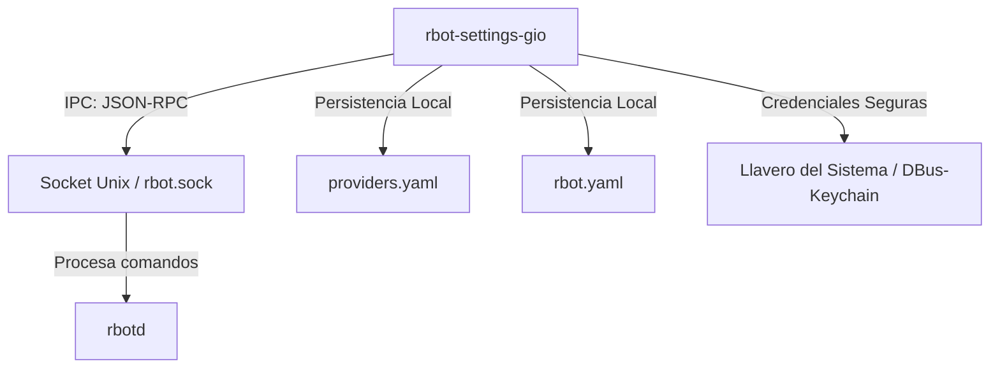

# RBot Settings (Gio UI) ⚙️

Este directorio contiene el panel de configuración gráfico de **RBot**, desarrollado en Go utilizando el framework de interfaz de usuario de alto rendimiento **Gio UI** (`gioui.org`). 

El panel permite a los usuarios gestionar proveedores de modelos de lenguaje (LLM), configurar métodos de autenticación seguros y seleccionar los modelos que utilizará el asistente, comunicándose dinámicamente con el daemon de fondo de RBot (`rbotd`) a través de un canal de IPC rápido (JSON-RPC sobre sockets Unix).

---

## 🗺️ Arquitectura de Comunicación

El panel de configuración opera como un cliente liviano y seguro de **RBot**:



* **IPC (Inter-Process Communication):** Se comunica con el daemon usando sockets Unix. Si el daemon está apagado, el panel sigue funcionando y guardando la configuración de manera resiliente directamente en los archivos locales.
* **Persistencia:** Guarda las selecciones y configuraciones en `rbot.yaml` y `providers.yaml`.
* **Seguridad de Credenciales:** Las API Keys y tokens de sesión nunca se guardan en texto plano en los archivos de configuración si el llavero del sistema está disponible. En su lugar, se delegan a `go-keyring`.

---

## 🎨 Componentes de la Interfaz de Usuario y Controles

La interfaz de usuario del panel cuenta con una estética premium de estilo "glassmorphic" oscuro con acentos de color neon adaptativos que pulsan en segundo plano.

A continuación se detallan los componentes principales presentes en [main.go](file:///home/style/Documentos/lenguajes/go/asistente/cmd/rbot-settings-gio/main.go):

### 1. Barra de Estado de Conexión (Live Badge)
* **Ubicación:** Esquina superior derecha del panel.
* **Componente:** `liveBadge` (función helper en la UI).
* **Descripción:** Muestra un indicador circular LED brillante animado en sincronía con la fase de pulso neon junto a la etiqueta `CONECTADO A DAEMON`.
* **Funcionamiento:** Informa al usuario que la interfaz tiene conectividad activa con el socket de control de `rbotd`.

### 2. Selector de Entorno (Tabs de Local vs Nube)
* **Componente:** Botones de pestaña controlados por `state.isLocal`.
* **Opciones:**
  * **LOCAL (OLLAMA):** Activa el modo local enfocado en servidores Ollama autohospedados.
  * **NUBE / CLOUD:** Activa la configuración de proveedores externos basados en API y Gateways.
* **Funcionamiento:** Al cambiar de pestaña se reconfigura la vista de proveedores, el método de autenticación por defecto (por ejemplo, `none` para Ollama, `api_key` para la Nube) y se consulta al daemon la lista de modelos correspondientes.

### 3. Selector de Proveedores
* **Componentes:** Fila de botones de selección controlados por `state.provBtns`.
* **Proveedores Soportados:**
  * **Ollama (Local):** Conexión con un daemon Ollama local o en red.
  * **OpenRouter (Nube):** Gateway compatible con OpenAI que unifica acceso a cientos de modelos.
  * **OpenAI (Nube):** Conexión nativa con la API de OpenAI.
  * **Gemini / Google (Nube):** Modelos de Google utilizando el endpoint compatible con OpenAI.
  * **Claude / Anthropic (Nube):** Acceso a modelos de Anthropic.
  * **DeepSeek (Nube):** Acceso directo a los servicios de DeepSeek.

### 4. Sección de Autenticación y Credenciales
El panel adapta esta sección de forma inteligente según el proveedor seleccionado:

* **Para Ollama (Local):**
  * Muestra una caja de edición de texto (`state.apiKeyEditor`) inicializada en `http://localhost:11434`.
  * Permite ingresar una dirección IP o URL personalizada en caso de que Ollama corra en otra máquina dentro de la red local.
* **Para Proveedores de Nube:**
  * **API KEY:** Una caja de texto segura para introducir el token. Si ya existe una clave en el llavero, mostrará de forma segura la etiqueta `[Clave guardada de forma segura en Llavero]`.
  * **Botón Desconectar / Borrar Clave Activa (`state.disconnectKeyBtn`):** Aparece solo si existe una clave configurada en el llavero. Elimina las credenciales guardadas de forma segura y limpia el estado para permitir ingresar una nueva clave.
  * **Método "Iniciar Sesión" (Browser Login / OAuth PKCE):**
    * **Para OpenAI:** Abre el navegador en `https://chatgpt.com` para que el usuario obtenga e introduzca manualmente la cookie de sesión necesaria.
    * **Para otros proveedores compatibles:** Levanta un servidor temporal local en Go (`llm.StartBrowserOAuth`) que escucha el callback OAuth PKCE y captura el token automáticamente tras loguearse en el navegador, rellenando el campo del token por el usuario.
  * **Método "Credenciales de Google Cloud" (ADC):** Indicado para Gemini; permite usar la autenticación predeterminada del SDK de Google Cloud.
  * **Método "Cuenta de Servicio" (Service Account):** Permite escribir la ruta absoluta hacia el archivo JSON de credenciales de Google.

### 5. Selector de Modelos (Model Grid)
* **Componentes:** Matriz de botones dinámicos en cuadrícula de 3 columnas controlados por `state.modelBtns`.
* **Carga Dinámica:**
  * Llama por IPC al daemon (`models.list`) pasándole el proveedor seleccionado para listar los modelos que están actualmente descargados o disponibles en la cuenta.
  * Si el daemon está desconectado u ocurre un error, el panel activa una lista inteligente de **fallbacks estáticos** de alta calidad (como `gpt-4o-mini`, `google/gemini-2.5-flash:free`, `qwen2.5:7b`, etc.) para asegurar que el usuario siempre pueda seleccionar y guardar un modelo válido.

### 6. Acciones y Operaciones
* **Test Conexión (`state.testBtn`):** Envía la solicitud `providers.status` al daemon por IPC para validar el estado de conexión del backend con la API externa o local del modelo seleccionado. La respuesta se despliega en la barra de estado inferior.
* **Aplicar y Activar Proveedor (`state.saveBtn`):**
  1. Extrae y limpia los valores de la UI.
  2. Guarda la clave o token de forma segura en el Llavero (`keyring.Set`) si es necesario.
  3. Modifica localmente `providers.yaml` configurando el proveedor y creando un perfil activo.
  4. Modifica localmente `rbot.yaml` indicando el proveedor activo, el modelo y el endpoint (`BaseURL`).
  5. Si el daemon está en ejecución, le envía un comando `profiles.use` para indicarle que cargue e inicialice el nuevo perfil inmediatamente (en caliente) sin reiniciar el servicio.

### 7. Barra de Estado / Logger Inferior
* **Componente:** `state.snapshot()`.
* **Descripción:** Una línea de texto informativa al pie del panel que detalla errores en color rojo o éxitos en verde brillante, además del estado actual (`Listo`, `Procesando...`, `Probando conexión...`, `Guardando y aplicando cambios...`, etc.).

---

## 🔒 Mecanismo de Seguridad y Keyring (Llavero)

Para evitar la exposición de credenciales sensibles, RBot utiliza un sistema híbrido de referencia de secretos (`SecretRef` y `SessionRef`):

1. **Llavero del Sistema (Recomendado):** El panel intenta almacenar las claves directamente en el gestor de contraseñas seguro del sistema operativo (Keychain en macOS/iOS, DBus Secret Service / Gnome Keyring / KWallet en Linux, Credential Manager en Windows).
   * En los archivos de configuración, se guarda la referencia: `keyring:<proveedor>_secret`.
2. **Variable de Entorno:** Si el usuario define la credencial en el entorno, se guarda la referencia: `env:NOMBRE_VAR`.
3. **Texto Plano (Fallback):** Si el llavero no está disponible, la clave se guarda precedida del prefijo `plain:` (encriptada si el sistema implementa una capa adicional de cifrado de config).

---

## 📂 Archivos de Configuración Involucrados

Cuando haces clic en **Aplicar y Activar**, RBot modifica los siguientes archivos:

### `rbot.yaml`
Establece la configuración global y el proveedor/modelo activo:
```yaml
model:
  provider: openrouter
  model: google/gemini-2.5-flash:free
  base_url: https://openrouter.ai/api/v1
```

### `providers.yaml`
Define los perfiles de conexión detallados:
```yaml
active_profile: openrouter_profile
active_provider: openrouter
active_model: google/gemini-2.5-flash:free
active_auth_mode: api_key

providers:
  openrouter:
    enabled: true
    type: compatible
    base_url: https://openrouter.ai/api/v1
    auth_mode: api_key
    secret_ref: keyring:openrouter_secret
    model: google/gemini-2.5-flash:free

profiles:
  openrouter_profile:
    provider: openrouter
    model: google/gemini-2.5-flash:free
    auth_mode: api_key
    secret_ref: keyring:openrouter_secret
    enabled: true
```

---

## 🛠️ Ejecución y Compilación del Panel

Para ejecutar el panel de ajustes en modo de desarrollo:
```bash
go run cmd/rbot-settings-gio/main.go
```

Para generar una build de producción optimizada:
```bash
go build -ldflags="-s -w" -o bin/rbot-settings cmd/rbot-settings-gio/main.go
```
